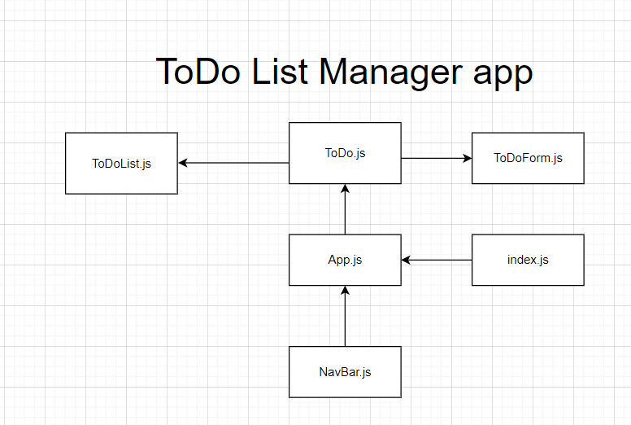

# Lab31- Hooks API: Todo App Manager
an application designed for creating and organizing a “To Do” list in your browser.

## Users Stories:
* As a user, I would like an easy way to add a new to do item using an online interface
* As a user, I would like my to do items to have an assignee, due date, difficulty meter, status and the task itself
* As a user, I would like to delete to do items that are no longer needed
* As a user, I would like to easily mark to do items as completed
* As a user, I would like to edit an existing to do item

## Deployment: 
[ToDo List Manager App](https://60a203f9d4660c968c65f94c--todolistappmanager.netlify.app/) 

* Author: Boshra Jaber
* Setup: 
  - To create a react app: `npx create-react-app app-name`
  - another way by adding npm flag: `npx create-react-app app-name --use-npm`
  - Remove the .git file so you don't have nested repo: `rm -rf .git`
  - To start the app: `npm start`
  - To use Sacc for styling: `npm i node-sass`
  - To install react bootsrap: ` npm install react-bootstrap bootstrap@4.6.0`

## UML

